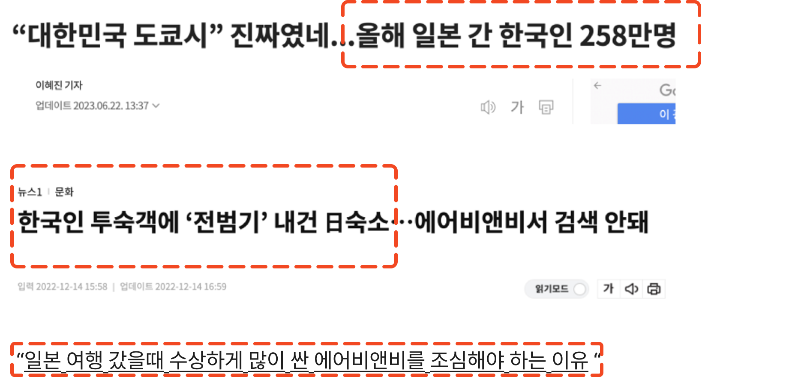

# 도쿄 에어비엔비 숙소 추천 프로젝트

## 🔥 구성원

| 구성원 | 깃허브 주소 | 역할 |  
| --- | --- | --- | 
| 이지은 | https://github.com/zinnie1025 | Project Leader |
| 장윤영 | https://github.com/Jyundev | Project Manager |

  

## 🖥️  Environment 
**비고** | **이지은(local)** | **이지은(local)** | **장윤영(local)** | **장윤영(local)**
-----|-------|-------|-------|-------|
**CPU** | Intel Core i9 | AMD Ryzen7-4 5800x | Intel Core i9 | i9-13900KF |
**RAM** | 16GB | 64GB | 16GB | 32GB |  
**Storage** | 1TB | 1TB | 1TB | 1TB |
**OS** | macOS | Windows 10 | macOS | Windows 11 |
**모바일** | iPhone 14 Pro | - | iPhone 13 Mini | - |

 

| Stack | Tools | Collaboration |
|-------|-------|---------------|
|  Python |  Git   Colab |  GitHub  Notion  Slack |

  

## Contents Table

- [프로젝트 개요](#📑-프로젝트-개요)
- [기대 효과](#🛎️-기대-효과)
- [프로젝트 설명](#✒️-프로젝트-설명)
- [모델 설명](#✒️-모델-설명)
- [Dataset](#📁-dataset)
- [Reference](#📌-reference)

  

## 📑 프로젝트 개요 

  

 

 에어비앤비를 통해 일본 여행을 계획 중에, "[일본 여행 갔을 때 수상하게 많이 싼 에어비앤비를 조심해야 하는 이유](https://kohwok.tistory.com/2747)"라는 게시글을 발견했습니다. 

해당 게시글은 주로 일본의 치안 상황을 잘 모르는 여행객들을 상대로, 호스트들이 치안이 좋지 않은 지역의 숙소를 극히 저렴한 가격에 제공하고 있다는 내용을 다루고 있었습니다.  후기에는 대부분의 한국인들이 좋은 별점과 함께 우호적인 평가를 작성하고 있어, 치안 위험 지역에도 한국인 여행객들이 많이 숙소를 예약하는 경향이 있었습니다.

실제로 에어비앤비를 확인한 결과, 가부키쵸와 산야지구 같은 위험 지역에서 저렴한 가격으로 숙소를 제공하는 사례가 있었습니다.

이에 따라, 여행객들에게 치안 정보를 추가하여 에어비앤비 숙소를 제공한다면, 더욱 안전하고 신뢰성 있는 선택을 할 수 있을 것으로 판단하여 해당 프로젝트를 기획하게 되었습니다

  

## 📆 프로젝트 목표 

| 기간 | 목표 |
| --- | --- |
| 1차 (2024.02.11 - 2024.02.28)| 데이터 수집 및 아키텍처 설계, 전체 플로우 설계, 수집 데이터 전처리 |
|2차 (2024.03.01 - 2024.03.23) | 도쿄 여행 최단 경로 알고리즘(필수), 공항 포함 경로(옵션) |
| 3차 (2024.03.24 - 2024.04.30) | 도쿄 안전 숙소 정보 제공(필수), 도쿄 여행 명소 실시간 티켓가(옵션)|

  

## 🛎️ 기대 효과
- 각 지역에 대한 치안 등급을 부여
    > 치안 데이터를 활용하여 각 지역의 상대적인 안전 수준을 판단합니다
- 안전 숙소 제안 
    > 치안 등급을 기반으로하여 여행객들에게 안전한 숙소를 추천합니다. 
- 숙소까지 최단 거리 경로 제공 
    >선택된 숙소까지 안전하고 효율적으로 이동할 수 있는 최단 거리 경로를 제공합니다. 

  

## ✒️  프로젝트 설명

  

  

## 📁 Dataset

| Title | link |
| --- | --- |
| Airbnb| <a href = http://insideairbnb.com/get-the-data>에어비앤비 도쿄 데이터</a> |
| 도쿄 부동산 사건 데이터  | <a href = http://www.oshimaland.co.jp>오시마랜드</a>|
| 도쿄 공공 데이터 |<a href = http://www.oshimaland.co.jp>절도 데이터 </a> |
